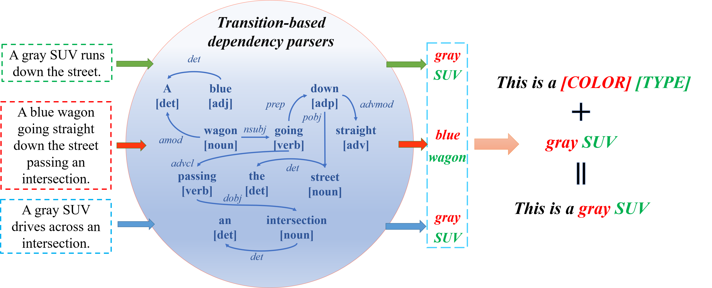

# OMG

OMG: Observe Multiple Granularities for Natural Language-Based Vehicle Retrieval

## Abstract

Retrieving tracked-vehicles by natural language descriptions plays a critical role in smart city construction. It aims to find the best match for the given texts from a set of tracked vehicles in surveillance videos. Existing works generally solve it by a dual-stream framework, which consists of a text encoder, a visual encoder and a cross-modal loss function. Although some progress has been made, they failed to fully exploit the information at various levels of granularity. To tackle this issue, we propose a novel framework for the natural language-based vehicle retrieval task, OMG, which Observes Multiple Granularities with respect to visual representation, textual representation and objective functions. For the visual representation, target features, context features and motion features are encoded separately. For the textual representation, one global embedding, three local embeddings and a color-type prompt embedding are extracted to represent various granularities of semantic features. Finally, the overall framework is optimized by a cross-modal multi-granularity contrastive loss function. Experiments demonstrate the effectiveness of our method. Our OMG significantly outperforms all previous methods and ranks 9th on the 6th AI City Challenge Track2. The codes are available at https://github.com/dyhBUPT/OMG.

## Framework




## Experiments


## Run

#### Data Preparation

Baidu Disk: [link](https://pan.baidu.com/s/1rxmlk-XZVTi5tjKOHTRAXg) with code "city"

#### Requirements

- [CLIP](https://github.com/openai/CLIP)
- requirements.txt

#### Train

```shell
python train.py --config configs/Swin-B+CLIP-B_OMG2a_NLAug_IDLoss.yaml --valnum 4
```

#### Test

```shell
python test.py
```

## Note

- We also design the OSG framework for the ensemble. Please refer to the [code](https://github.com/binging512/AICity2022Track2-OSG) for details.

## Citation

TBA

## Acknowledgement

A large part of the codes are borrowed from [CLT](https://github.com/ShuaiBai623/AIC2021-T5-CLV). Thanks for their excellent work!
